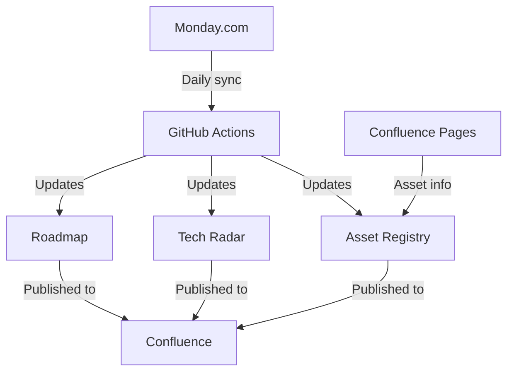

# Architecture-Roadmap
Road map repository for Engineering Architecture team.

## Purpose
This repository contains automation tools for the Architecture Team to maintain and publish:
 - The team roadmap (shown below)
 - A technology radar
 - An asset registry

## 🛤️ Architecture Team Roadmap 2025

> **View full roadmap**: [Architecture Roadmap](https://davidroche7.github.io/Roadmapv2/)
>
> **Download formats**: [HTML](https://davidroche7.github.io/Roadmapv2/roadmap-simple.html) | [Confluence Markup](https://davidroche7.github.io/Roadmapv2/export-confluence.html)

## Current Implementation

The current implementation provides a client-side rendered roadmap based on JSON data:

1. **Core Data Source**: `roadmap-data.json` contains all project information
2. **HTML Views**:
   - `index.html` - Main page that embeds the roadmap
   - `roadmap-simple.html` - Standalone roadmap with Gantt chart and table
   - `export-confluence.html` - Confluence markup exporter

### How It Works
1. Edit the `roadmap-data.json` file to update the roadmap data
2. The HTML files read this JSON data and render it dynamically in the browser
3. No build process or server-side rendering required

### Current Features
- Gantt chart showing project timelines
- Detailed project table with all metadata
- Export to CSV functionality
- Confluence markup export
- Responsive design with improved formatting

## Future Plans

This is a simplified version of a more comprehensive system planned for the future. The complete system will include:

## Planned Components

### 1. Roadmap
The roadmap (currently implemented) displays architecture team activities organized by team member. It includes:
 - Project/product name
 - Status (done, active, planned)
 - Timeline (start and end dates)

### 2. Technology Radar
We plan to use the existing company Tech Radar and automatically update it with technologies from our projects. The automation will:
 - Extract technologies from Monday.com projects and confluence
 - Format them for the Tech Radar
 - Push updates to the Tech Radar repository

### 3. Asset Registry
The planned asset registry will provide a comprehensive inventory of all technology assets with:
 - Technology name and type
 - Maturity level within the organisation
 - Projects using the technology
 - Links to documentation in Confluence

## Prerequisites for Future Implementation

### Monday.com Setup
A Monday.com board with the following columns:
 - Technologies (tags/multiple values)
 - Status (status column)
 - Owner (person column)
 - Start Date (date column)
 - End Date (date column)
 - Monday.com API token with read access to the board

### Confluence Setup
A Confluence space where documentation will be published:
 - Architecture Team Roadmap
 - Technology Radar
 - Asset Registry
 - Confluence API credentials with write access to these pages

### GitHub Setup
 - Repository secrets configured with API credentials

## Planned Configuration
 - All configuration settings will be stored in `config.json`:
 - Monday.com board and column IDs
 - Confluence space and page IDs
 - Tech Radar quadrant and ring definitions

## How It Will Work
 - GitHub Actions workflow will run daily to fetch data from Monday.com
 - The data will be processed to update the roadmap
 - Technologies mentioned in projects will be extracted for the Tech Radar
 - The Asset Registry will be compiled from Tech Radar data and Confluence
 - All visualizations will be published to Confluence for wider access

## Adding New Projects (Future)
To add a new project to the system:
 - Add a new item to the Monday.com board
 - Fill in all required columns (technologies, status, owner, dates)
 - The automation will include the new project in the next update

## Maturity Levels for Technology (TBC)
Technology maturity will be determined automatically based on:
 - Adoption across projects
 - Status of projects using the technology

The levels are:
 - Adopted: Technology is widely used and proven
 - Trial: Technology is being used in limited projects
 - Assessing: Technology is being evaluated
 - Unknown: Maturity level not determined
